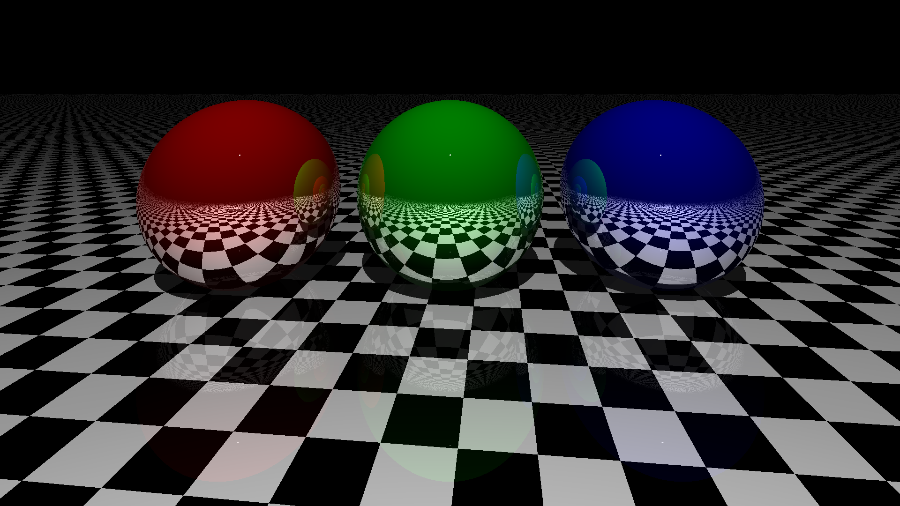
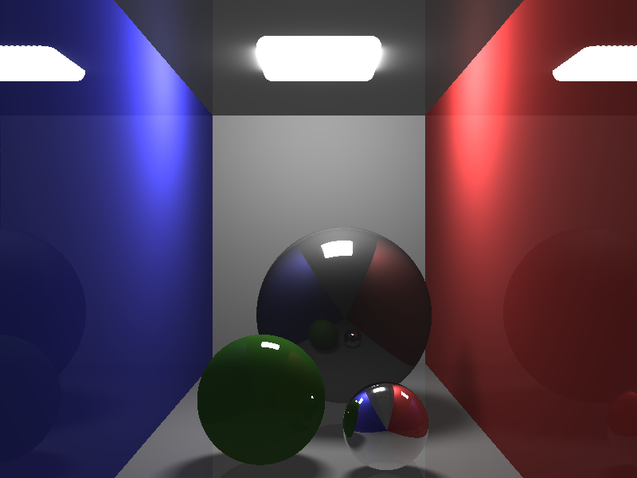

# Ray tracing

By Quen69fr.

## Purpose

Recreate standard raytracing in python with following features :

* Sphere and planes / rectangles
* Multi light source
* Ambient light
* Reflexion (mirrors)
* Colors
* Specular reflexion (gloss)
* Textures mapping
* Scene animation and video mp4 (and gif)
* Pure python
* Multiprocessing

## Install and requirements

Clone from GitHub and Install Prerequisite
* python3
* numpy
* pillow (PIL)
* moviepy
* tqdm (progress bar)

python3 -m pip install -r requirements.txt

## Usage

1. [Create/Edit scene in scene_manager.py](#Create a new scene)
2. [Edit cpu/ressources in small main.py](#Create images and videos)
3. Launch : python3 main.py
The computation is quite slow, don't be suprices if it takes a few minutes to produce a video...

### Create a new scene

1. Create a new scene id
2. Set up the scene in the `SceneManager` `__init__` function
   * Create a `Viewer` _with a position relative to the screen (z=0)_
   * Create a `Scene` _with ambient colors, background colors, mirror depths (intensity)..._
   * Add __objects__ in the scene (`Sphere`, `Plane`, `Recangles`) _with positions, colors, glossiness,
mirror effets..._
   * Add __sources__ in the scene (`LightSource`) _with positions, intensities, colors, radiuses..._
   * And settle some video features (the number total of frames, the `params` attribute in order to pass information
for the next frames...)
3. Use the `update` function from `SceneManager` to make your scene evolves frame by frame
   * You then have access to __t__ (the frame's number) and 
__step__ (__t - step__ being the frame's number the scene's state is when the function is called)
   * Rotate the scene (or some specific lights or objects) around the y-axis
   * Directly modify some object/light parameters
   * Add and delete objects and lights
   * ...
The scene is then ready to be drawn !

### Create images and videos

In the small main.py, after creating a `SceneManager` instance with the desire scene id.
* To compute a single image : Use the `create_image` function of your instance. Here are the parameters :
  * `t: int = 0` The frame's number of te scene you want to draw.
  * `multiprocessing: bool = False` If you want to parallelize the image's computation (to go faster). 
  * `num_cpu: int = 1` In case of `multiprocessing`, the number of processur you want to use.
Don't use more CPU than the number available on your machine.
  * `preview_mod: int = 1` To compute only 1 pixel over `preview_mod` just to have a preview.
  * `images_saved_path: str = "Image.png"` The path where you want to save te resulting image.
  * `log: bool = True` If you want a progress bar to see the advancement of the image's computation.

* To compute a video : Use the `create_video` function of your instance. Here are the parameters :
  * `multiprocessing: bool = False` If you want to parallelize the images' computation (to go faster).
  * `num_cpu: int = 1`In case of `multiprocessing`, the number of processur you want to use.
Don't use more CPU than the number available on your machine.
  * `multiprocessing_images: bool = False`In case of `not multiprocessing`, if you to parallelize each image's 
computation individually.
  * `video_path: str = "Video.mp4"` `None` if you don't want a mp4 video, otherwise, the path where you want to save te 
resulting video.
  * `num_revolutions_video: int = 1` If `video_path`, number of time(s) you want to play your animation in the video.
  * `fps: int = 30` Number of frames per seconds for the video or gif.
  * `gif_path: str = None` `None` if you don't want to make a gif, otherwise, the path where you want to save te 
resulting gif.
  * `images_saved_path: str = "Frames/Image_#.png"` The path you want to save the frames during the computation.
  * `store_directions_viewer_in_memory: bool = True` If you want to store the ray directions from a frame to the other
(it takes quite some memory, but it is a bit faster...).
  * `log: bool = True` If you want a progress bar to see the advancement of the image computation.

## Design notes

The core function of the ray tracing computation is the `calcul_ray_intensity` function from the `Scene` class.
It is a recursive function which for a starting point and a directions returns the RGB intensities received.
Here are all the math for the computation of the intersections between the rays and the objects,
and the calcul of the RGB sent back intensities depending on the colors, the glossiness, the mirror effect...

Multiprocessing can be either by distributing frames to each process (when making a movie)
or distributing various part of a single image.

## Evolution / TODO

If interested, don't hesitate to reuse and extend the program; 
or to create and share other mindful and beautiful scenes...

Ideas:
* Texture for spheres
* Other shapes/objects : triangles, polygones (convex...), disk...
* Bounding shapes (avoid testing the intersections on the other side of the scene or to avoid same complicated calcul 
shape intersections...)
* Add texture for : the shapes (delimit the edges), the glossiness and the mirror reflection (gray scale)...
* Add waves length instead of RGB colors
* Translucent surface : Diffusion, refraction... (in the calcul_ray_intensity function, the boolean inverse_normal
directly says from which to which materials the light ray goes)
* Load STL files
* Put all the scene configuration and animation (from the `SceneManager` class) in separate files (json?)
